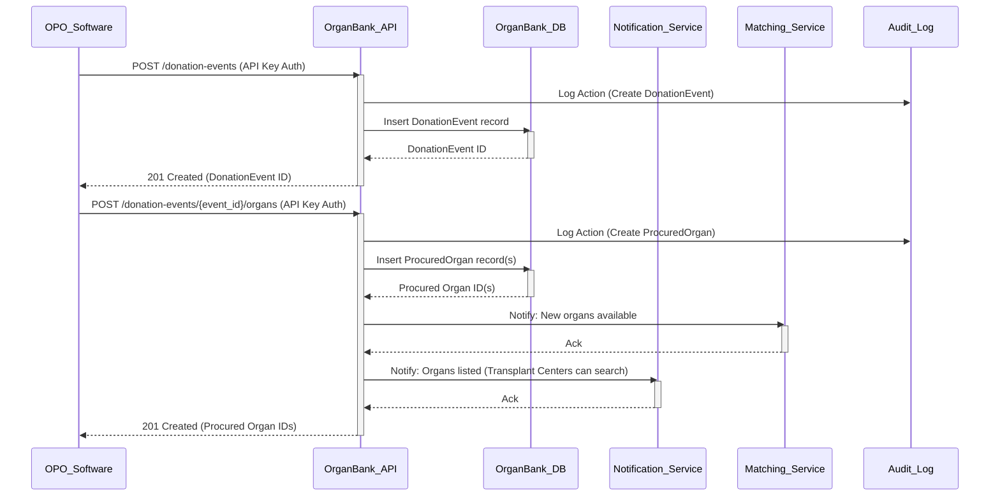
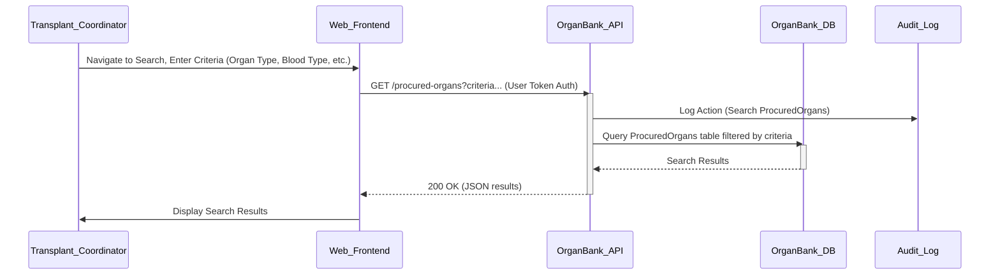
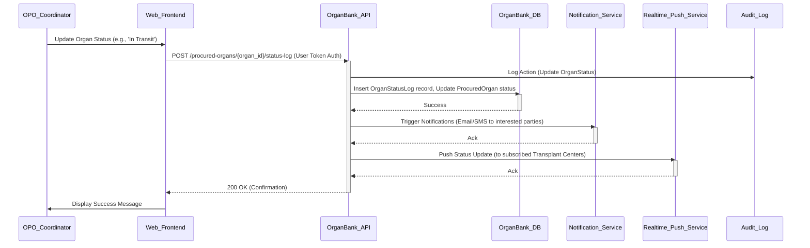

Okay, let's elevate the previous PRD to a more robust, large-scale design suitable for a real-time system serving a hospital domain or major donation organization. This involves a more detailed data model, explicit API definitions, and complex interaction flows.

This design assumes a backend API-first approach, where the frontend website (like your initial example) would consume data from these APIs, and other systems (like hospital EHRs or OPO software) could potentially integrate via these APIs as well.

---

# OrganBank System - Product Requirements Document (PRD) - V1.0 (Large Scale)

## 1. Introduction

### 1.1. Purpose
This document defines the requirements for a robust, large-scale OrganBank system designed to facilitate the complex process of organ donation, procurement, matching, and transplantation. It serves as a central platform for connecting potential donors, managing donation events, listing available organs with critical medical data, enabling secure search and matching processes, and providing communication channels between various stakeholders in the hospital domain and organ donation ecosystem.

### 1.2. Goals
*   To provide a secure and reliable platform for managing the entire organ donation lifecycle, from initial intent registration to post-transplant tracking.
*   To enable real-time (or near-real-time) updates and communication regarding organ availability and status.
*   To securely store and manage sensitive medical and personal data related to donors, organs, and potentially recipients (in future phases).
*   To support complex search and matching based on critical medical criteria.
*   To provide necessary interfaces (APIs) for integration with external systems (EHRs, OPO software).
*   To ensure compliance with relevant privacy regulations (HIPAA, GDPR, etc.) and ethical guidelines.
*   To offer comprehensive logging and auditing capabilities for accountability.

### 1.3. Scope
This phase (V1.0 Large Scale) focuses on:
*   Enhanced User Authentication & Authorization (including organizational roles).
*   Detailed Donor Registration and consent management (Platform-level intent).
*   Secure Management of Donation Events (when a potential donation occurs).
*   Detailed Tracking of Procured Organs with associated medical markers (Blood Type, HLA, etc.).
*   Status tracking and logging for Procured Organs (Real-time updates capability).
*   Secure API endpoints for creating, updating, and querying Donation Events and Procured Organs.
*   Advanced Search and Filtering of Procured Organs based on multiple medical criteria.
*   Basic internal matching features (identifying potential candidates based on criteria, without complex ranking algorithms initially).
*   Email and potentially other notification mechanisms for status changes and matches.
*   Comprehensive Audit Logging.
*   Generation of official-style PDF documents for platform-level intent and potentially organ details (excluding sensitive donor PII in external docs).

Features explicitly **out of scope** for this phase:
*   Full, legally binding consent management (requires legal framework integration).
*   Integration with *external* national/international transplant registries or allocation systems.
*   Advanced, optimized organ matching algorithms (UNOS/Eurotransplant complexity).
*   Recipient registration, management, or waiting list features (Recipients are assumed to exist in external systems and are referenced by ID or criteria for matching).
*   Financial transaction processing.
*   Built-in communication/chat features (though APIs could support this externally).
*   Detailed medical history storage beyond essential donation criteria.

### 1.4. Glossary
*   **Donor:** An individual who has registered intent or from whom organs are procured.
*   **Recipient:** An individual requiring an organ transplant.
*   **OPO:** Organ Procurement Organization - entity responsible for recovering organs.
*   **Transplant Center:** Hospital/facility where transplantation occurs.
*   **API:** Application Programming Interface - used for system-to-system communication.
*   **PII:** Personally Identifiable Information.
*   **PHI:** Protected Health Information (under HIPAA).
*   **HLA Typing:** Human Leukocyte Antigen typing - crucial for tissue matching.
*   **Crossmatch:** Test to see if recipient's antibodies react to donor tissue.
*   **Donation Intent:** A user's declaration of willingness to donate organs within the OrganBank *platform*.
*   **Donation Event:** An instance where organ procurement is occurring or has occurred from a specific individual (deceased or living - primarily deceased in V1 scope).
*   **Procured Organ:** A specific organ recovered from a Donation Event.
*   **Medical Marker:** Specific medical characteristics of a donor or organ (Blood Type, HLA, etc.).

## 2. Target Audience / User Roles

This design requires a more granular breakdown of roles and permissions, often tied to specific organizations.

| Role                     | Description                                                                 | Key Permissions (API Interactions)                                                                                                                               |
| :----------------------- | :-------------------------------------------------------------------------- | :--------------------------------------------------------------------------------------------------------------------------------------------------------------- |
| **Guest User**           | Unregistered visitor.                                                       | Read public information (`GET /organ-types`). Register user account (`POST /users`).                                                                           |
| **Registered User (Donor)** | An individual who has created an account for platform-level intent.       | Read/Update own profile (`GET/PUT /users/{user_id}`), Manage platform intent (`GET/POST/PUT /users/{user_id}/donation-intent`), Generate PDF (`GET /utilities/pdf/intent/{intent_id}`). |
| **Organization Admin**   | Manages users and settings within a specific Hospital or OPO organization.  | Manage Organization Users (`GET/POST/PUT/DELETE /organizations/{org_id}/users`), Manage some org settings (`PUT /organizations/{org_id}`).                     |
| **OPO Coordinator**      | Manages donation events and organ procurement.                              | Create Donation Events (`POST /donation-events`), Add Procured Organs (`POST /donation-events/{event_id}/organs`), Update Organ Status (`POST /procured-organs/{organ_id}/status-log`). |
| **Transplant Coordinator** | Manages potential recipients and searches for organs.                       | Search Procured Organs (`GET /procured-organs`), View detailed Organ Info (`GET /procured-organs/{organ_id}`), Log Transplant Outcome (`POST/PUT /transplants`). |
| **System Administrator** | Manages the entire OrganBank system.                                        | All permissions, Manage Organizations (`GET/POST/PUT/DELETE /organizations`), View System Analytics (`GET /admin/analytics`), Audit Logs (`GET /admin/audit-log`). |
| **API User**             | Represents an external system (EHR, OPO software) accessing the API.        | Permissions defined by specific API keys/tokens, typically mirroring OPO or Transplant Coordinator roles for automated tasks.                               |

## 3. Data Model (Detailed)

This schema is designed for scalability, normalized data, and explicit relationships to handle complex real-world scenarios. Uses UUIDs for primary keys to facilitate distributed system potential and external referencing without exposing record counts.

```mermaid
erDiagram
    users {
        uuid id PK "UUID"
        varchar email UK "User's email"
        varchar password_hash
        varchar first_name
        varchar last_name
        varchar phone_number
        varchar street_address
        varchar city
        varchar state_province
        varchar country
        varchar postal_code
        date date_of_birth
        varchar gender
        varchar preferred_language
        bool email_verified
        datetime created_at
        datetime updated_at
        datetime last_login_at
        text profile_picture_url -- optional
        -- Consent flags (e.g., marketing, data usage)
    }

    user_roles {
        uuid user_id FK
        uuid organization_id FK
        varchar role_name -- 'organization_admin', 'opo_coordinator', 'transplant_coordinator'
        datetime assigned_at
        PRIMARY KEY (user_id, organization_id, role_name)
    }

    organizations {
        uuid id PK "UUID"
        varchar name UK "Organization name (e.g., Hospital, OPO)"
        varchar type -- 'Hospital', 'OPO', 'Transplant Center'
        varchar street_address
        varchar city
        varchar state_province
        varchar country
        varchar postal_code
        varchar phone_number
        varchar email
        varchar website_url
        bool is_active
        datetime created_at
        datetime updated_at
    }

    organ_types {
        uuid id PK "UUID"
        varchar name UK "Organ name (e.g., Kidney, Heart, Lung)"
        text description
        -- Standard characteristics for this organ type
    }

    medical_marker_types {
        uuid id PK "UUID"
        varchar name UK "Marker name (e.g., Blood Type, HLA-A, HLA-B)"
        varchar data_type -- 'string', 'enum', 'number'
        text description
        -- Validation rules, allowed values (for enum)
    }

    medical_marker_values {
        uuid id PK "UUID"
        uuid marker_type_id FK
        varchar value "Actual value (e.g., 'A+', 'B8', 'DR4')"
        datetime created_at
        datetime updated_at
        -- Could add flags like is_valid, is_rare
    }

    user_platform_intents {
        uuid id PK "UUID"
        uuid user_id FK "Link to the user account"
        uuid organ_type_id FK "Which organ they intend to donate"
        datetime declared_at
        bool is_active -- User can revoke platform intent
        text notes -- Optional notes about intent on platform
        datetime created_at
        datetime updated_at
        -- Disclaimer: This is platform intent, not legal consent.
    }

    donation_events {
        uuid id PK "UUID"
        uuid source_organization_id FK "Hospital/OPO where donation originated"
        varchar donation_type -- 'Deceased Donor', 'Living Donor'
        varchar donor_external_id -- Reference ID in source system (avoid PII here if possible)
        datetime event_start_timestamp
        datetime event_end_timestamp -- When procurement is complete
        varchar status -- 'Pending', 'Active Procurement', 'Completed', 'Cancelled'
        varchar cause_of_death -- Sensitive - needs strict access control
        text clinical_summary -- Highly sensitive
        text notes
        uuid created_by_user_id FK "User who initiated the event record"
        datetime created_at
        datetime updated_at
    }

    procured_organs {
        uuid id PK "UUID"
        uuid donation_event_id FK "From which donation event this organ came"
        uuid organ_type_id FK "What type of organ is this"
        uuid current_organization_id FK "Current location/custodian organization"
        varchar organ_external_id -- Reference ID in source system
        datetime procurement_timestamp
        datetime preservation_timestamp -- Start of cold ischemia time
        datetime estimated_warm_ischemia_time_minutes
        datetime estimated_cold_ischemia_time_minutes
        datetime expiry_timestamp -- Estimated viability end
        varchar status -- 'Procured', 'Packaged', 'In Transit', 'At Transplant Center', 'Transplanted', 'Discarded', 'Unsuitable'
        text description -- e.g., 'Left Kidney'
        varchar blood_type -- Redundant with markers but common search field
        text clinical_notes -- Highly sensitive - Condition, characteristics
        text packaging_details
        uuid created_by_user_id FK "User who added this organ record"
        datetime created_at
        datetime updated_at
        -- Geographic data (optional)
    }

    organ_medical_markers {
        uuid procured_organ_id FK
        uuid medical_marker_value_id FK "Link to the specific marker value (e.g., 'A+')"
        datetime recorded_at
        uuid recorded_by_user_id FK
        PRIMARY KEY (procured_organ_id, medical_marker_value_id)
    }

    organ_status_log {
        uuid id PK "UUID"
        uuid procured_organ_id FK "Which organ this log entry is for"
        varchar old_status
        varchar new_status
        text status_notes
        datetime timestamp
        uuid changed_by_user_id FK "User who changed the status"
    }

    transplants {
        uuid id PK "UUID"
        uuid procured_organ_id FK "Which organ was transplanted"
        uuid transplant_center_id FK "Where the transplant occurred"
        varchar recipient_external_id -- Reference ID in recipient system
        datetime transplant_timestamp
        varchar outcome -- 'Successful', 'Failed', 'Pending Evaluation'
        text notes -- Post-transplant clinical notes (sensitive)
        uuid recorded_by_user_id FK "User who recorded the outcome"
        datetime created_at
        datetime updated_at
        -- Recipient Medical Markers could be linked here or referenced externally
    }

    audit_log {
        uuid id PK "UUID"
        uuid user_id FK "User who performed the action (or API key ID)"
        varchar action -- e.g., 'CREATE', 'UPDATE', 'DELETE', 'VIEW'
        varchar entity_type -- 'User', 'Organization', 'DonationEvent', etc.
        uuid entity_id -- ID of the entity affected
        json_object changes -- Details of the change (e.g., {"field": "status", "old": "Procured", "new": "In Transit"})
        text ip_address
        text user_agent
        datetime timestamp
    }

    api_keys {
         uuid id PK "UUID"
         varchar key_hash UK "Hashed API key"
         uuid organization_id FK
         varchar role_name -- e.g., 'api_access_opo', 'api_access_transplant'
         datetime created_at
         datetime expires_at
         datetime last_used_at
         bool is_active
    }

    users ||--o{ user_roles : "assigned_role"
    organizations ||--o{ user_roles : "has_user_with_role"
    organizations ||--o{ donation_events : "is_source_of"
    organizations ||--o{ procured_organs : "is_current_custodian_of"
    organizations ||--o{ transplants : "is_center_for"
    users ||--o{ user_platform_intents : "declares_intent"
    organ_types ||--o{ user_platform_intents : "intends_to_donate"
    organ_types ||--o{ procured_organs : "is_of_type"
    medical_marker_types ||--o{ medical_marker_values : "has_value"
    medical_marker_values ||--o{ organ_medical_markers : "is_marker_value"
    procured_organs ||--o{ organ_medical_markers : "has_marker"
    donation_events ||--o{ procured_organs : "yields"
    procured_organs ||--o{ organ_status_log : "status_history"
    procured_organs ||--o{ transplants : "was_transplanted"
    users ||--o{ audit_log : "performed_action"
    api_keys ||--o{ audit_log : "used_key"
    organizations ||--o{ api_keys : "owns_key"
    users ||--o{ donation_events : "created_by"
    users ||--o{ procured_organs : "created_by"
    users ||--o{ organ_status_log : "changed_by"
    users ||--o{ transplants : "recorded_by"
    users ||--o{ organ_medical_markers : "recorded_by"

```

**Key Enhancements in Data Model:**
*   **UUIDs:** For distributed and scalable IDs.
*   **Organizational Structure:** `organizations` and `user_roles` explicitly model the relationships between users and their affiliated hospitals/OPOs/Transplant Centers.
*   **Separation of Intent vs. Event:** `user_platform_intents` is distinct from `donation_events` and `procured_organs`. The former is a user's registration *on the platform*, the latter is a real-world medical event.
*   **Detailed Organ Tracking:** `donation_events` and `procured_organs` capture critical timestamps (procurement, preservation, estimated ischemia times), status, and location (`current_organization_id`).
*   **Flexible Medical Markers:** `medical_marker_types` and `medical_marker_values` with the linking table `organ_medical_markers` allow tracking various markers (Blood Type, HLA alleles, etc.) in a structured way, essential for matching.
*   **Status History:** `organ_status_log` provides a clear audit trail of an organ's journey.
*   **Transplant Outcomes:** `transplants` table tracks what happened to an organ *after* it reached a center.
*   **Audit Log:** Essential for tracking all system actions, crucial in a regulated domain.
*   **API Keys:** Separate table for managing API access for external systems.

## 4. API Design

An API-first approach using REST principles is recommended.

*   **Base URL:** `https://api.organbank.org/v1/`
*   **Authentication:**
    *   **User Login:** OAuth 2.0 or similar standard for user sessions, returning access tokens.
    *   **System-to-System:** API Keys (`api_keys` table) with role-based access control. API keys are hashed in the database; actual keys are transmitted securely (HTTPS).
*   **Authorization:** Role-based access control (RBAC) is enforced at the API level using user roles (`user_roles`) or API key roles (`api_keys`). Permissions are granted based on roles (e.g., only OPO Coordinator or API User with `api_access_opo` role can `POST /donation-events`). Row-level security is critical (e.g., a Hospital User can only view organs currently at their hospital unless granted broader search permissions).
*   **Data Format:** JSON for requests and responses.
*   **Error Handling:** Standard HTTP status codes (e.g., 200 OK, 201 Created, 400 Bad Request, 401 Unauthorized, 403 Forbidden, 404 Not Found, 500 Internal Server Error). Detailed error messages in the JSON body.
*   **Versioning:** Use URL versioning (`/v1/`).

### 4.1. Key API Endpoints (Examples)

*   `POST /users` - Register a new user.
*   `POST /auth/login` - User login (returns token).
*   `GET /users/{user_id}` - Get user profile (requires user ID or permission).
*   `PUT /users/{user_id}` - Update user profile (requires user ID or permission).
*   `GET /users/{user_id}/platform-intent` - Get user's platform donation intent.
*   `POST /users/{user_id}/platform-intent` - Declare or update platform intent.
*   `GET /organizations` - List organizations (Admin/authorized users).
*   `POST /organizations` - Create organization (Admin).
*   `GET /organizations/{org_id}` - Get organization details.
*   `PUT /organizations/{org_id}` - Update organization details (Org Admin/Admin).
*   `GET /organ-types` - List available organ types.
*   `GET /medical-marker-types` - List medical marker types.
*   `GET /medical-marker-values` - List medical marker values, filterable by type.
*   `POST /donation-events` - Create a new donation event (OPO Coordinator/API User).
*   `GET /donation-events/{event_id}` - Get details of a donation event.
*   `GET /procured-organs` - **Search/Filter Procured Organs**. (Most critical for finding organs).
    *   Query parameters: `organ_type_id`, `blood_type`, `status`, `current_organization_id`, `min_expiry_timestamp`, `medical_markers={marker_type_id}:{value_id},{marker_type_id}:{value_id}...` etc. Supports complex filtering.
*   `POST /donation-events/{event_id}/organs` - Add a procured organ to an event (OPO Coordinator/API User).
*   `GET /procured-organs/{organ_id}` - Get details of a specific procured organ (requires permission).
*   `POST /procured-organs/{organ_id}/status-log` - Add a status update for an organ (OPO Coordinator/Transplant Coordinator/API User). **Triggers notifications.**
*   `GET /procured-organs/{organ_id}/status-log` - Get history of status changes for an organ.
*   `POST /transplants` - Record a transplant outcome (Transplant Coordinator/API User).
*   `GET /admin/analytics` - Get system-level analytics (Admin).
*   `GET /admin/audit-log` - View audit log (Admin).
*   `GET /utilities/pdf/platform-intent/{intent_id}` - Generate PDF for platform intent confirmation.
*   `GET /utilities/pdf/procured-organ/{organ_id}` - Generate PDF summary for a procured organ (excluding sensitive PII).

## 5. API Flows / Scenarios (Schematic Diagrams)

These diagrams show the sequence of calls between different system components and external systems.

### 5.1. OPO Reporting a New Donation Event and Procured Organs (System-to-System via API)


*   **Description:** An OPO's internal software system uses the OrganBank API to report that a donation event has occurred and lists the specific organs procured. This triggers internal matching processes and notifications to potential recipient centers.

### 5.2. Transplant Center Searching for Organs (via Web Frontend)


*   **Description:** A transplant coordinator uses the OrganBank website's search interface, which calls the backend API to retrieve a list of matching available organs.

### 5.3. Updating Organ Status (Real-time Update Trigger)


*   **Description:** An OPO coordinator updates the status of an organ (e.g., marking it as 'In Transit'). This API call logs the change, updates the main organ record, triggers email notifications to relevant personnel (e.g., at the receiving transplant center), and pushes a real-time update via a service like WebSockets to any connected frontend or API clients subscribed to updates for that organ or related searches.

## 6. Security & Compliance

Given the highly sensitive nature of organ donation data, robust security and compliance are paramount.
*   **Data Encryption:** Encryption at rest (database, file storage) and in transit (HTTPS/SSL/TLS for all API calls).
*   **Access Control:** Strict role-based access control (RBAC) enforced at the API layer. Users/API keys only access data and perform actions explicitly allowed by their assigned roles and organization affiliation. Row-level security implemented in the database where necessary (e.g., limit organ visibility based on location or permissions).
*   **Authentication:** Secure user authentication with strong password policies, multi-factor authentication (MFA) recommended for critical roles. Secure API key management (hashed storage, rotation policies).
*   **Auditing:** Comprehensive audit logs tracking all access and modifications to sensitive data (as per `audit_log` table).
*   **Privacy Regulations:** Design must comply with HIPAA (USA), GDPR (Europe), and other relevant regional data privacy laws. This includes data minimization, purpose limitation, explicit consent management (for data stored *beyond* clinical necessity linked to a donation event), and the right to access/rectify/erase data where applicable and legally permissible in this context. Legal counsel is essential here.
*   **Data Minimization:** Only collect and store data strictly necessary for the system's function. Anonymize or pseudonymize data where possible, especially for long-term storage or analytics.
*   **Consent:** While the `user_platform_intents` table records consent for *this platform*, real-world organ donation requires separate, legally binding consent (often managed by OPOs/Hospitals), which this system would *record the fact of*, but not *manage the legal process* itself in V1.
*   **Regular Security Audits & Penetration Testing:** Essential practices.

## 7. Scalability & Reliability

*   **Database:** Use a scalable database solution (e.g., PostgreSQL, MySQL with replication/sharding, or a cloud-native database service). Design for high availability and disaster recovery (HA/DR).
*   **API:** Stateless API design allows horizontal scaling of API servers behind a load balancer.
*   **Messaging Queue:** Use a message queue (e.g., RabbitMQ, Kafka, SQS) for asynchronous tasks like sending emails, generating PDFs, triggering complex matching, and notifying the real-time push service. This decouples services and improves responsiveness.
*   **Real-time Push:** Implement a dedicated service (e.g., WebSockets server, dedicated push notification service) for broadcasting real-time updates, separate from the main API.
*   **Service-Oriented Architecture (SOA) / Microservices:** As the system grows, consider breaking down functionality (e.g., Matching Service, Notification Service, PDF Service) into independent services for better maintainability and scalability.
*   **Monitoring & Alerting:** Implement comprehensive monitoring for system health, performance, and security events. Set up alerts for critical issues.

## 8. Logging & Auditing

*   Every significant action (user login, API call, data creation/update/deletion, status change, search query for sensitive data) must be logged in the `audit_log` table, including the user/API key, timestamp, action type, entity affected, and details of the change.
*   Application logs should capture errors, warnings, and informational messages for debugging and monitoring.
*   Logs must be protected, retained according to policy (especially for compliance), and regularly reviewed.

## 9. Future Enhancements (Beyond V1 Large Scale)

*   Recipient/Waiting List Management: Full features for managing recipient profiles and their medical criteria.
*   Advanced Matching Algorithms: Implement complex, prioritized matching logic based on medical urgency, location, tissue typing, etc.
*   Integration Hub: More sophisticated integration capabilities with external EHR/EMR systems, national registries via standardized APIs (e.g., FHIR profiles for organ donation).
*   Mobile Applications: Dedicated apps for OPO coordinators, transplant teams.
*   AI/ML for Organ Viability Prediction: Analyze clinical data to assist in assessing organ suitability.
*   Supply Chain Tracking: Detailed tracking of organ transport and logistics.
*   Living Donor Management: Specific workflows and data structures for living donations.
*   Recipient Tracking Portal: Allows recipients to view their status (with appropriate privacy controls).

---

This detailed PRD, with the enhanced data model and API focus, provides a much more solid foundation for building a large-scale system capable of meeting the complex demands of the hospital domain and organ donation process, while keeping future expansion in mind. Remember that implementing such a system requires not just technical expertise but also deep understanding of the medical, legal, and ethical frameworks governing organ donation.